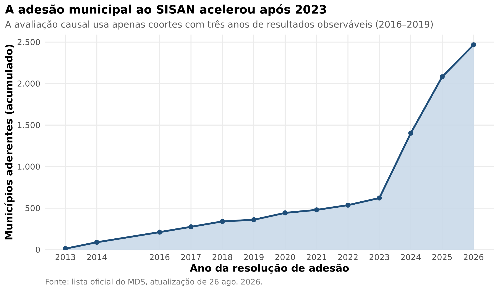
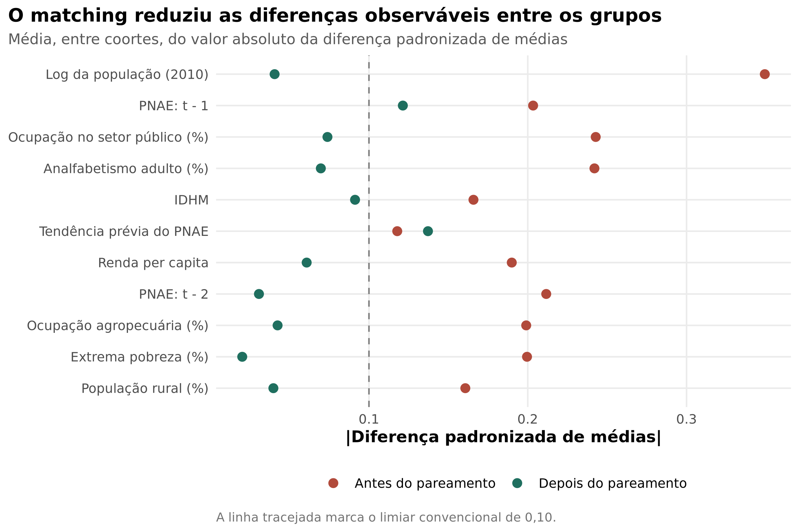
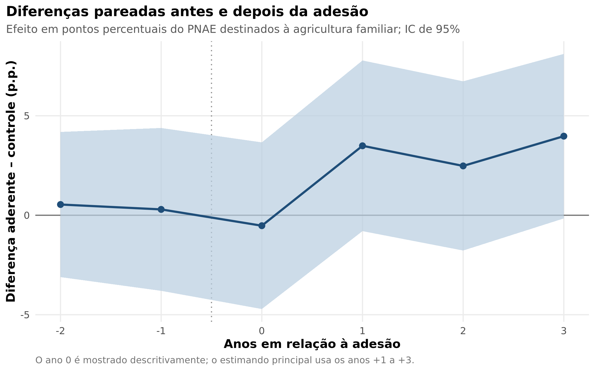
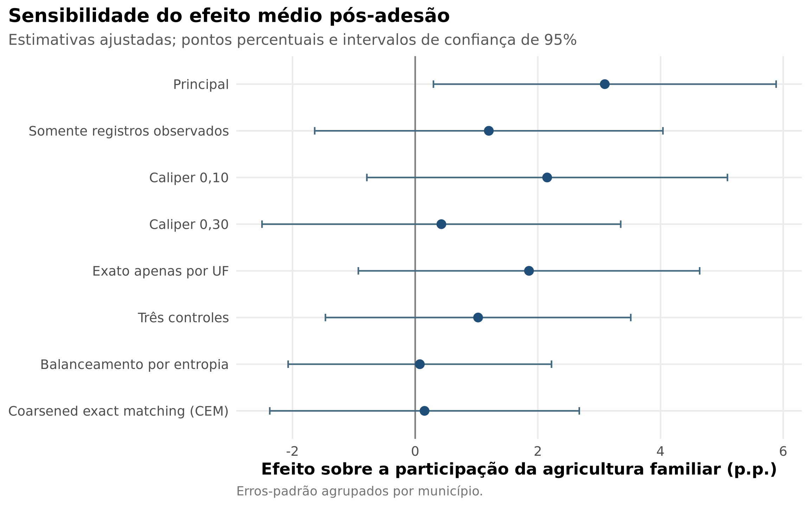

> **Identificação do autor para completar antes da submissão:** afiliação, ORCID, e-mail, contribuições CRediT, financiamento e agradecimentos.

# Resumo

A adesão municipal ao Sistema Nacional de Segurança Alimentar e Nutricional (SISAN) cria conselhos, câmaras intersetoriais e compromissos de planejamento, mas não garante automaticamente recursos ou capacidade de implementação. Este artigo estima se essa institucionalização formal melhora um resultado situado na interseção entre alimentação, educação e desenvolvimento rural: a participação dos recursos do Programa Nacional de Alimentação Escolar (PNAE) empregada em compras da agricultura familiar. Combinamos a lista oficial de adesões ao SISAN, dados administrativos do Fundo Nacional de Desenvolvimento da Educação e covariáveis municipais do Atlas do Desenvolvimento Humano. Para as coortes de adesão de 2016 a 2019, construímos conjuntos anuais de risco e pareamos cada município aderente a um município do mesmo estado e estrato populacional, ainda não tratado durante os três anos subsequentes. O pareamento utiliza distância de Mahalanobis dentro de caliper de 0,20 desvio-padrão do escore de propensão e considera resultados pré-tratamento e características demográficas, socioeconômicas e produtivas. Foram pareados 238 aderentes. Na especificação principal ajustada, a adesão está associada a aumento de 3,09 pontos percentuais na participação média das compras da agricultura familiar nos três anos seguintes (IC95%: 0,30; 5,88). O efeito estimado sobre o cumprimento do mínimo legal histórico de 30% é de 3,90 pontos percentuais (IC95%: −1,58; 9,37). Entretanto, estimativas com casos completos, calipers alternativos, três controles, balanceamento por entropia e coarsened exact matching são menores e compatíveis com efeito nulo. Os resultados sugerem um ganho modesto, porém frágil: a adesão pode organizar a coordenação local, mas sua formalização, isoladamente, não parece suficiente para transformar de modo consistente a implementação.

**Palavras-chave:** segurança alimentar e nutricional; SISAN; PNAE; agricultura familiar; avaliação de políticas públicas; matching; capacidade estatal.

# Abstract

Municipal accession to Brazil’s National Food and Nutrition Security System (SISAN) establishes councils, intersectoral chambers, and planning commitments, but does not automatically provide implementation resources or capacity. This article estimates whether such formal institutionalization improves an outcome at the intersection of food, education, and rural development: the share of National School Feeding Program (PNAE) funds spent on family-farming purchases. We combine the official SISAN accession roster, administrative data from the National Fund for Education Development, and municipal covariates from the Human Development Atlas. For the 2016–2019 accession cohorts, we construct annual risk sets and match each acceding municipality to one municipality in the same state and population stratum that remained untreated throughout the following three years. Matching uses Mahalanobis distance within a 0.20-standard-deviation propensity-score caliper and incorporates pretreatment outcomes and demographic, socioeconomic, and productive characteristics. A total of 238 treated municipalities were matched. In the adjusted primary specification, accession is associated with a 3.09-percentage-point increase in the average family-farming purchase share over the next three years (95% CI: 0.30, 5.88). The estimated effect on compliance with the historical 30% legal threshold is 3.90 percentage points (95% CI: −1.58, 9.37). However, complete-case analyses, alternative calipers, three-control matching, entropy balancing, and coarsened exact matching yield smaller estimates consistent with no effect. The evidence therefore points to a modest but fragile gain: accession may organize local coordination, yet formal institutionalization alone does not appear sufficient to consistently transform implementation.

**Keywords:** food and nutrition security; SISAN; school feeding; family farming; policy evaluation; matching; state capacity.

# 1. Introdução

Instituições participativas e arranjos intersetoriais podem melhorar a coordenação de políticas públicas, mas sua criação formal não equivale necessariamente à produção de capacidade estatal. Essa tensão é particularmente importante no Sistema Nacional de Segurança Alimentar e Nutricional (SISAN). Criado pela Lei nº 11.346/2006, o sistema procura articular Estado e sociedade civil em torno do direito humano à alimentação adequada. No plano municipal, a adesão é voluntária e pressupõe a formação de um conselho de segurança alimentar e nutricional, uma câmara governamental intersetorial e a elaboração de um plano municipal. Em princípio, esses componentes podem reduzir a fragmentação entre assistência social, saúde, educação, agricultura e planejamento. Na prática, contudo, a existência de normas e colegiados pode permanecer dissociada de pessoal, orçamento, autoridade e rotinas administrativas.

A literatura sobre a descentralização do SISAN documentou implantação municipal incipiente, baixa presença de planos e fragilidades de indução federativa (Vasconcellos & Moura, 2018; Silva & Panelli-Martins, 2020). Esses trabalhos foram decisivos para caracterizar o sistema, mas deixam aberta uma pergunta causal e operacional: **a adesão formal ao SISAN melhora a execução de políticas que dependem de coordenação intersetorial no nível local?** A pergunta não deve ser respondida apenas comparando aderentes e não aderentes. Municípios que ingressam voluntariamente no sistema podem já dispor de burocracias mais qualificadas, organizações rurais mais estruturadas, maior compromisso político com segurança alimentar ou desempenho superior antes da adesão.

Este artigo enfrenta o problema de seleção por meio de matching por conjuntos anuais de risco. O resultado escolhido é a proporção dos recursos federais do Programa Nacional de Alimentação Escolar (PNAE) destinada à compra direta da agricultura familiar. Durante 2014–2022, o artigo 14 da Lei nº 11.947/2009 exigia aplicação mínima de 30% dos repasses do Fundo Nacional de Desenvolvimento da Educação (FNDE) nessas compras. O indicador é especialmente informativo porque transformar repasses em aquisições locais requer comunicação entre secretarias, nutricionistas, setor de compras, assistência técnica, agricultores e organizações fornecedoras. Ele não é um resultado exclusivo do SISAN, mas constitui uma medida observável de implementação situada no mesmo campo intersetorial.

O desenho compara os municípios que aderiram ao SISAN entre 2016 e 2019 a municípios do mesmo estado e porte populacional que não haviam aderido e permaneceram sem adesão ao longo dos três anos de seguimento. O pareamento considera dois anos de desempenho prévio no PNAE, tendência prévia, população, ruralidade, pobreza, renda, ocupação agropecuária, analfabetismo, emprego público e desenvolvimento humano. A estratégia aproxima a comparação de um experimento em que, dentro de grupos observavelmente semelhantes e elegíveis em um mesmo momento, apenas uma unidade adere.

Três resultados merecem destaque. Primeiro, 238 dos 271 municípios pertencentes às coortes avaliáveis foram pareados, com forte redução geral das diferenças observáveis, embora a pequena coorte de 2019 conserve desequilíbrio residual. Segundo, a estimativa ajustada principal indica aumento de 3,09 pontos percentuais nas compras da agricultura familiar nos três anos posteriores à adesão. Terceiro, esse achado não se mostra estável em todas as decisões analíticas: o efeito diminui e torna-se impreciso quando se alteram o tratamento da ausência de registros, o caliper, a razão de controles ou o estimador de balanceamento. A contribuição, portanto, não é demonstrar uma transformação inequívoca. É mostrar que a institucionalização pode estar associada a melhora modesta no desenho principal, mas que a evidência não permite concluir que a adesão, sem reforço de capacidades e recursos, seja suficiente para mudar consistentemente a execução municipal.

Além desta introdução, o artigo apresenta o SISAN e os mecanismos que podem conectar adesão e implementação; descreve dados, estimando e desenho de matching; reporta os diagnósticos e resultados; e discute as implicações para coordenação federativa, capacidades locais e avaliação de políticas de adesão voluntária.

# 2. Institucionalização, coordenação e capacidade de implementação

## 2.1 O que a adesão ao SISAN modifica

O SISAN foi concebido como um sistema público intersetorial e participativo. Sua descentralização combina pactuação federativa, instâncias governamentais e controle social. Para aderir, o município deve demonstrar a existência de marco normativo local, conferência, conselho de segurança alimentar e nutricional e câmara intersetorial; também assume o compromisso de elaborar o plano municipal e manter as instâncias em funcionamento. A adesão, portanto, não é apenas um rótulo administrativo. Ela pode introduzir arenas estáveis de interação, atribuir responsabilidades, dar visibilidade à agenda e induzir planejamento.

Há ao menos três mecanismos pelos quais essas mudanças podem alcançar a compra da agricultura familiar no PNAE. O primeiro é informacional. Conselhos e câmaras podem compartilhar diagnósticos sobre oferta, sazonalidade e organizações locais, reduzindo falhas entre agricultores e gestores. O segundo é organizacional. A formalização pode aproximar educação, agricultura, assistência social e compras públicas, facilitando chamada pública, cardápio, logística e prestação de contas. O terceiro é político. A participação social pode elevar o custo de negligenciar metas e manter o tema na agenda entre ciclos eleitorais.

Esses mecanismos são plausíveis porque a implementação do PNAE não depende apenas da disponibilidade de recursos federais. A literatura identifica heterogeneidade regional, produtiva e administrativa, além de dificuldades associadas ao porte, à modalidade de gestão e à presença de profissionais responsáveis (Machado et al., 2018). Estudos de caso mostram que colaboração entre secretarias e apoio local à agricultura familiar distinguem trajetórias de execução (Silva, 2023). Evidências quantitativas mais recentes associam capacidades técnico-administrativas e político-relacionais ao percentual de compras (Rodrigues et al., 2024). Em conjunto, esses trabalhos tornam razoável esperar que um arranjo destinado a coordenar a política de segurança alimentar produza efeitos para além de sua própria estrutura formal.

## 2.2 Por que a formalização pode não bastar

O argumento oposto é igualmente forte. Conselhos, câmaras e planos podem ser criados para atender requisitos documentais, mas funcionar de maneira irregular. A adesão não assegura uma equipe permanente, orçamento municipal adicional, autoridade sobre outras secretarias ou oferta agrícola compatível com o cardápio escolar. Silva e Panelli-Martins (2020) mostraram que, no estágio inicial da descentralização, menos de 40% dos aderentes estudados possuíam planos publicados e que a qualificação técnica constituía obstáculo. Vasconcellos e Moura (2018) também destacaram a ausência de um papel federal indutor suficientemente forte e a relevância de mecanismos de financiamento e atribuição de responsabilidades.

Há ainda um problema de seleção. A adesão voluntária pode ocorrer justamente onde as condições que favorecem compras da agricultura familiar já estavam presentes. Nesse caso, uma associação positiva após a adesão confundiria efeito institucional com capacidade preexistente. Alternativamente, municípios podem aderir em resposta a desempenho insatisfatório, gerando seleção negativa. A ausência de randomização impede eliminar essas possibilidades apenas com regressão transversal.

Derivamos duas expectativas empíricas, formuladas como hipóteses direcionais, mas avaliadas com atenção à estabilidade entre especificações:

**H1.** A adesão municipal ao SISAN aumenta, nos três anos subsequentes, a proporção média dos recursos do PNAE destinada à agricultura familiar.

**H2.** A adesão municipal ao SISAN aumenta a probabilidade de cumprimento do mínimo legal de 30% vigente durante o período estudado.

Se a adesão modifica capacidades e rotinas, as duas estimativas devem ser positivas e relativamente estáveis. Se produz principalmente conformidade formal, efeitos pequenos, imprecisos ou sensíveis às escolhas analíticas são mais prováveis.

# 3. Dados e métodos

## 3.1 Fontes e unidade de análise

A unidade de análise é o município-coorte. Foram integradas três fontes públicas.

Primeiro, a lista oficial de municípios aderentes ao SISAN, atualizada pelo Ministério do Desenvolvimento e Assistência Social, Família e Combate à Fome (MDS) em 26 de agosto de 2026, fornece código do IBGE, unidade federativa, município, número e data da resolução de adesão. O arquivo contém 2.467 municípios, com coortes entre 2013 e 2026. A data da resolução define o ano de tratamento.

Segundo, as planilhas anuais do FNDE informam o valor transferido pelo PNAE, o valor adquirido da agricultura familiar e o percentual correspondente. Empregamos os anos de 2014 a 2022, último intervalo contínuo disponibilizado nas planilhas arquivadas utilizadas. As rotinas de importação identificam as colunas apesar das mudanças de nomes e formatos, padronizam valores monetários e percentuais e mantêm apenas entidades municipais. Percentuais acima de 100, que podem refletir recursos próprios adicionados ao repasse federal ou inconsistências de registro, são limitados a 100 para formar um resultado de implementação com suporte entre 0 e 100.

Terceiro, o Atlas do Desenvolvimento Humano fornece covariáveis estruturais medidas em 2010: população, proporção rural, extrema pobreza, renda per capita, ocupação agropecuária, analfabetismo adulto, ocupação no setor público e Índice de Desenvolvimento Humano Municipal (IDHM). A defasagem temporal evita controlar por características potencialmente afetadas pela própria adesão, embora reduza a capacidade de representar mudanças locais imediatamente anteriores ao tratamento.

O painel balanceado de referência contém os 5.565 municípios compatíveis com o universo municipal de 2010 e nove anos, totalizando 50.085 observações município-ano. A cobertura anual das planilhas do FNDE varia de 88,2% a 99,6%. Na especificação principal, a ausência de um município no extrato anual de aquisições válidas é interpretada como zero compra **registrada** naquele arquivo. Como ausência também pode refletir prestação de contas pendente ou inválida, repetimos a análise somente com municípios observados em todos os períodos pré e pós relevantes.

## 3.2 Tratamento, resultados e janela temporal

O tratamento é a adesão formal ao SISAN no ano da resolução publicada. Avaliamos as coortes de 2016, 2017, 2018 e 2019. As adesões de 2013 e 2014 não possuem dois anos de resultados pré-tratamento nas planilhas iniciadas em 2014; coortes a partir de 2020 não possuem três anos pós-tratamento até 2022. A opção preserva uma janela simétrica comum de dois anos anteriores e três posteriores.

O resultado primário é a média da participação percentual das compras da agricultura familiar nos anos (g+1), (g+2) e (g+3), em que (g) é o ano de adesão. O ano (g) é excluído do estimando principal porque a resolução pode ocorrer em qualquer mês e porque processos de compra iniciados antes da adesão podem dominar o resultado contemporâneo. O resultado secundário é a proporção dos três anos posteriores em que o município atinge ao menos 30%.

O limiar de 30% corresponde à regra vigente durante todo o período de resultados, de 2014 a 2022. A Lei nº 15.226/2025 elevou o mínimo para 45%, com aplicação a partir de 2026. Essa mudança posterior não altera a definição histórica de cumprimento utilizada aqui, mas limita comparações diretas com o regime atual.

## 3.3 Matching por conjuntos de risco

Para cada coorte (g), construímos um conjunto de risco contendo: (a) municípios que aderiram naquele ano; e (b) municípios que nunca aderiram segundo a lista ou cuja adesão ocorreu após (g+3). Assim, nenhum controle é tratado durante a janela de resultados da coorte. A abordagem segue a lógica de risk-set matching para exposições que surgem em momentos distintos (Li, Propert, & Rosenbaum, 2001).

O escore de propensão é estimado por regressão logística dentro de cada conjunto de risco. Inclui o log da população, ruralidade, extrema pobreza, renda per capita, ocupação agropecuária, analfabetismo adulto, ocupação no setor público, IDHM, o percentual de compras em (g-2) e (g-1), e a diferença entre esses dois resultados pré-tratamento. Cada aderente é pareado sem reposição a um controle por distância de Mahalanobis nas principais covariáveis contínuas, restrita por caliper de 0,20 desvio-padrão do escore de propensão. O pareamento é exato por unidade federativa e por cinco classes populacionais: até 20 mil; 20–50 mil; 50–100 mil; 100–500 mil; e mais de 500 mil habitantes.

O uso do escore apenas como restrição, combinado à distância de Mahalanobis, evita tratar a proximidade unidimensional do escore como garantia automática de equilíbrio multivariado. A qualidade do desenho é avaliada por diferenças padronizadas de médias antes e depois do pareamento. Valores absolutos abaixo de 0,10 são utilizados como referência, sem convertê-los em teste mecânico de validade. Quando um estrato exato não oferece controle próximo, o aderente é descartado, o que redefine o efeito para a região de suporte comum.

O estimando é o efeito médio do tratamento sobre os tratados pareados (ATT):

$$
ATT = E\{Y_i(1)-Y_i(0) \mid D_i=1,\ i \in \mathcal{S}\},
$$

em que $D_i$ indica adesão e $\mathcal{S}$ representa o suporte comum produzido pelo desenho. Após o pareamento, estimamos diferenças ponderadas com efeitos fixos de coorte. A especificação ajustada adiciona a média e a tendência pré-tratamento para absorver pequenos desequilíbrios residuais. Os erros-padrão são agrupados por município, pois um mesmo controle pode ser elegível e selecionado em mais de uma coorte. Intervalos de confiança são de 95%.

A interpretação causal depende de quatro condições: (1) independência condicional, isto é, ausência de determinantes não observados que afetem simultaneamente adesão e resultados após o condicionamento; (2) sobreposição, avaliada no suporte observado; (3) ausência de antecipação substantiva; e (4) ausência de interferência relevante entre municípios. A última pode ser violada se estruturas regionais do SISAN ou redes de fornecedores atravessarem fronteiras municipais.

## 3.4 Análises de sensibilidade

Foram pré-especificadas no código sete alternativas ao modelo principal: (a) casos completos nos cinco períodos utilizados para cada coorte; (b) caliper de 0,10; (c) caliper de 0,30; (d) pareamento exato apenas por estado; (e) três controles por aderente; (f) balanceamento por entropia para o ATT; e (g) coarsened exact matching (CEM). Também apresentamos diferenças anuais do tempo relativo (g-2) a (g+3), com o objetivo diagnóstico de verificar se aderentes e controles já divergiam antes do tratamento. Essas diferenças não constituem um estudo de evento de diferenças-em-diferenças e não dependem de uma hipótese formal de tendências paralelas.

Todo o processamento e a análise foram realizados em R. O suplemento contém dados brutos arquivados, dados derivados, testes, configuração, tabelas, figuras e um comando único de reprodução.

# 4. Resultados

## 4.1 Expansão do SISAN e composição da amostra

A lista oficial registra 12 adesões em 2013 e 360 acumuladas até 2019. A expansão foi lenta até 2023 e acelerou em 2024–2026: 781 municípios ingressaram em 2024, 679 em 2025 e 385 até a atualização de 2026, alcançando 2.467 adesões acumuladas. Esse salto torna o período recente promissor para avaliações futuras, mas ainda sem seguimento suficiente no PNAE para o desenho deste artigo.

Nas coortes avaliáveis havia 122 aderentes em 2016, 64 em 2017, 65 em 2018 e 20 em 2019. O algoritmo pareou, respectivamente, 105, 56, 62 e 15 municípios: 238 tratados no total, ou 87,8% dos 271 aderentes dessas coortes. Como alguns controles foram selecionados em mais de uma coorte, as 238 observações de controle correspondem a 217 municípios distintos. A amostra de estimação contém 455 municípios únicos.

**Tabela 1. Composição do pareamento por coorte**

| Coorte | Aderentes elegíveis | Controles elegíveis | Aderentes pareados | Controles pareados | Maior SMD após |
|---:|---:|---:|---:|---:|---:|
| 2016 | 122 | 5.205 | 105 | 105 | 0,130 |
| 2017 | 64 | 5.122 | 56 | 56 | 0,139 |
| 2018 | 65 | 5.086 | 62 | 62 | 0,148 |
| 2019 | 20 | 5.029 | 15 | 15 | 0,266 |

*Nota:* SMD = diferença padronizada de médias. O máximo inclui todas as covariáveis do modelo de tratamento e os indicadores das variáveis exatas. Fonte: elaboração própria.

## 4.2 Equilíbrio e diagnósticos do desenho

Antes do pareamento, as maiores diferenças absolutas por coorte atingiam entre 0,66 e 1,15 desvio-padrão. Depois do pareamento, as médias das diferenças absolutas ficaram próximas ou abaixo de 0,10 para a maior parte das covariáveis contínuas. O balanceamento exato eliminou diferenças de composição por estado e classe populacional. Permaneceram diferenças acima de 0,10 em alguns resultados pré-tratamento, especialmente na tendência da coorte de 2019, cujo máximo foi 0,266. Por isso, os modelos finais ajustam novamente a média e a tendência prévia e os resultados da coorte pequena não são interpretados isoladamente.

Na amostra pareada, a média prévia do percentual destinado à agricultura familiar foi 31,26% entre aderentes e 30,84% entre controles. Nos três anos posteriores, as médias brutas foram 37,72% e 34,40%, respectivamente. Os aderentes cumpriram o mínimo histórico em 60,92% dos anos de seguimento, contra 56,72% nos controles. Essas diferenças descritivas antecipam efeitos positivos pequenos, mas não substituem a estimativa ajustada.

## 4.3 Efeitos sobre compras e cumprimento do mínimo legal

A diferença não ajustada na média pós-tratamento foi de 3,31 pontos percentuais (IC95%: −0,15; 6,78; p = 0,061). Após o ajuste pela média e tendência prévias, o ATT foi de 3,09 pontos percentuais (IC95%: 0,30; 5,88; p = 0,030). Em relação à média pós-tratamento de 34,40% nos controles pareados, a magnitude ajustada equivale a aproximadamente 9%.

Para o resultado secundário, a diferença não ajustada no cumprimento anual do limiar de 30% foi 4,20 pontos percentuais (IC95%: −2,04; 10,45). O modelo ajustado produziu 3,90 pontos percentuais (IC95%: −1,58; 9,37; p = 0,163). Portanto, a estimativa pontual é positiva, mas a incerteza abrange desde pequena redução até ganho substantivo.

**Tabela 2. Efeito médio estimado da adesão nos três anos posteriores**

| Resultado | Especificação | ATT | Erro-padrão | IC95% | p |
|---|---|---:|---:|---:|---:|
| Compras da agricultura familiar (p.p.) | Não ajustada | 3,31 | 1,76 | [−0,15; 6,78] | 0,061 |
| Compras da agricultura familiar (p.p.) | Ajustada | 3,09 | 1,42 | [0,30; 5,88] | 0,030 |
| Cumprimento do mínimo de 30% (p.p.) | Não ajustada | 4,20 | 3,18 | [−2,04; 10,45] | 0,187 |
| Cumprimento do mínimo de 30% (p.p.) | Ajustada | 3,90 | 2,79 | [−1,58; 9,37] | 0,163 |

*Nota:* modelos com efeitos fixos de coorte, pesos do pareamento e erros-padrão agrupados por município. O ajuste adiciona média e tendência dos dois anos pré-tratamento. Para cumprimento, os coeficientes de uma regressão linear de probabilidade foram multiplicados por 100. Fonte: elaboração própria.

As diferenças anuais pareadas foram 0,54 ponto percentual em (g-2) e 0,29 em (g-1), ambas imprecisas e próximas de zero. No ano da resolução, a diferença foi −0,53. Nos três anos seguintes, as estimativas foram 3,49, 2,48 e 3,97 pontos percentuais. Os intervalos individuais incluem zero, embora o limite superior e a sequência de sinais positivos sejam compatíveis com melhora gradual. O padrão prévio reduz a preocupação com uma diferença de nível já estabelecida, mas não testa tendências paralelas nem exclui antecipação ou confundimento não observado.

## 4.4 Robustez e fragilidade

O resultado principal não se repete com magnitude semelhante em todas as especificações. A análise de casos completos produz 1,20 ponto percentual (IC95%: −1,64; 4,04). O caliper mais restrito resulta em 2,15 pontos; o mais amplo, 0,43. Permitir apenas pareamento exato por estado gera 1,86 ponto e usar três controles, 1,03. Balanceamento por entropia e CEM produzem estimativas próximas de zero. No balanceamento por entropia, alguns pesos são extremos, o que exige cautela adicional; o resultado é reportado como contraste de sensibilidade, não como substituto preferível.

**Tabela 3. Especificações alternativas para o resultado primário**

| Especificação | ATT (p.p.) | IC95% | Municípios |
|---|---:|---:|---:|
| Principal | 3,09 | [0,30; 5,88] | 455 |
| Somente registros observados | 1,20 | [−1,64; 4,04] | 403 |
| Caliper 0,10 | 2,15 | [−0,79; 5,09] | 433 |
| Caliper 0,30 | 0,43 | [−2,50; 3,35] | 453 |
| Exato apenas por UF | 1,86 | [−0,93; 4,64] | 492 |
| Três controles | 1,03 | [−1,46; 3,51] | 751 |
| Balanceamento por entropia | 0,08 | [−2,07; 2,22] | 5.476 |
| CEM | 0,15 | [−2,37; 2,68] | 1.166 |

*Nota:* todas as estimativas são ajustadas pela média e tendência prévias, com efeitos fixos de coorte e erros-padrão agrupados por município. O número de municípios pode exceder o da amostra principal porque algumas alternativas usam mais controles e outro suporte. Fonte: elaboração própria.

O conjunto de resultados não autoriza selecionar apenas o coeficiente com intervalo que exclui zero. A leitura adequada é que o desenho principal identifica um ganho modesto dentro de uma região de suporte estrita, enquanto alterações defensáveis no suporte e na mensuração deslocam a estimativa em direção a zero. Essa sensibilidade é informação substantiva: se a adesão produz efeitos, eles parecem depender do tipo de município comparado e da forma como a execução administrativa é registrada.

# 5. Discussão

## 5.1 O que os resultados sugerem

Os resultados oferecem apoio limitado à primeira hipótese e não confirmam a segunda. Na amostra pareada principal, a adesão ao SISAN precede aumento médio de cerca de três pontos percentuais na destinação do PNAE à agricultura familiar. A direção é coerente com mecanismos de articulação entre setores, circulação de informação e participação social. A ausência de diferença prévia expressiva também torna menos plausível que o coeficiente reflita somente níveis históricos de desempenho.

Ao mesmo tempo, a falta de estabilidade impede interpretar o valor de 3,09 como efeito consolidado da política. Especificações que mudam o tratamento dos registros ausentes ou reconstroem o contrafactual produzem estimativas menores. O efeito sobre o cumprimento da regra de 30% também é impreciso. Em termos de teoria da implementação, o padrão é compatível com uma instituição que pode facilitar coordenação na margem, mas não substitui recursos, burocracia, oferta produtiva e rotinas de compras.

Essa conclusão dialoga com dois conjuntos de evidências. Os estudos sobre o SISAN apontam que adesão e efetivo funcionamento das instâncias não caminham necessariamente juntos (Vasconcellos & Moura, 2018; Silva & Panelli-Martins, 2020). A literatura sobre PNAE mostra, por sua vez, que capacidade técnico-administrativa, relações interorganizacionais e características do contexto produtivo condicionam as compras (Machado et al., 2018; Silva, 2023; Rodrigues et al., 2024). O presente artigo conecta as duas agendas: a institucionalização do sistema pode ser parte da capacidade, mas não é uma medida suficiente dela.

## 5.2 Implicações para a política pública

A principal implicação é que metas de adesão devem ser acompanhadas por indicadores de funcionamento. Contar leis, conselhos e termos assinados informa capilaridade formal; não demonstra frequência de reuniões, participação social efetiva, existência de equipe, integração do plano ao orçamento ou coordenação com educação e agricultura. O monitoramento poderia distinguir adesão, implantação e funcionamento, permitindo que assistência técnica e transferências priorizem gargalos específicos.

Uma segunda implicação é explorar explicitamente a ponte entre SISAN e PNAE. O município poderia incorporar ao plano de segurança alimentar metas sobre mapeamento da oferta, elaboração de cardápios compatíveis, cronograma de chamadas públicas, apoio documental aos fornecedores e logística. Essas tarefas distribuem responsabilidades e transformam a câmara intersetorial em espaço de solução de problemas, em vez de instância apenas formal.

Terceiro, a expansão de 2024–2026 cria oportunidade de aprendizagem em escala. Como o mínimo do PNAE aumentou de 30% para 45% a partir de 2026, futuras coortes enfrentarão simultaneamente uma expansão do SISAN e uma meta mais exigente. A avaliação desse novo período deverá separar os dois choques, acompanhar intensidade de funcionamento e utilizar resultados além de compras, como existência de planos, execução orçamentária, insegurança alimentar e diversidade de fornecedores.

## 5.3 Limitações

Primeiro, matching equilibra apenas variáveis observadas. Liderança política, qualidade da burocracia, mobilização social, presença de cooperativas e apoio de governos estaduais podem influenciar adesão e compras, permanecendo como fontes de confundimento. Por isso, “efeito” é empregado no sentido do estimando sob as hipóteses declaradas, e não como garantia produzida por randomização.

Segundo, a fonte de tratamento é a lista oficial atualizada em 2026. Caso municípios historicamente aderentes tenham sido suspensos ou retirados da lista, a cronologia pode omitir tratamentos passados. Além disso, a data formal não mede quando as instituições começaram a funcionar nem sua intensidade. Esse erro pode atenuar efeitos e torna a interpretação condicional ao cadastro oficial disponível.

Terceiro, as planilhas do FNDE mudam de estrutura e regras de extração ao longo dos anos. A ausência no extrato foi codificada como zero compra registrada na análise principal, mas pode significar prestação pendente ou inconsistente. A redução do coeficiente nos casos completos mostra que a conclusão depende parcialmente dessa decisão. A forte queda nacional em 2020–2021 também reflete o choque da pandemia sobre a alimentação escolar e a prestação de contas. Efeitos fixos de coorte e comparações dentro do mesmo período absorvem choques comuns, não impactos heterogêneos.

Quarto, o PNAE é um resultado a jusante do SISAN, mas não exclusivo do sistema. Mudanças podem ocorrer por iniciativas próprias da Secretaria de Educação, assistência técnica, associações rurais ou órgãos de controle. O estudo identifica um efeito de intenção institucional da adesão, não o mecanismo específico de conselhos ou câmaras.

Quinto, o ATT refere-se aos aderentes das coortes de 2016–2019 com suporte comum. Ele não se generaliza automaticamente às adesões muito mais numerosas de 2024–2026. A expansão recente pode envolver municípios com menor capacidade prévia e um contexto federativo diferente.

# 6. Conclusão

Este artigo avaliou se a adesão municipal ao SISAN melhora a implementação de compras da agricultura familiar no PNAE. O matching por conjuntos de risco construiu comparações dentro do mesmo estado, porte e trajetória observável. Na especificação principal, a adesão está associada a aumento ajustado de 3,09 pontos percentuais nos três anos seguintes, mas o efeito sobre o cumprimento do mínimo histórico de 30% é impreciso e as análises alternativas aproximam o resultado primário de zero.

A conclusão mais defensável é, portanto, condicional: a adesão pode produzir um ganho marginal de coordenação em parte dos municípios, porém a evidência não sustenta que a formalização, sozinha, transforme consistentemente a capacidade de implementação. Para que o SISAN vá além da capilaridade normativa, a expansão precisa ser acompanhada por pessoal, orçamento, apoio técnico, integração entre planos e compras e monitoramento do funcionamento real de suas instâncias.

O achado de fragilidade não é ausência de contribuição. Ele delimita o que pode ser esperado de políticas baseadas em adesão voluntária e criação de colegiados: instituições importam, mas seus efeitos dependem dos recursos e das relações que lhes dão vida.

# Declarações

**Disponibilidade de dados e código.** O suplemento de replicação acompanha esta versão. Ele contém scripts em R, arquivos brutos arquivados, dados processados, testes automatizados, tabelas e figuras. As fontes oficiais e suas URLs estão documentadas em `docs/fontes_e_proveniencia.md` e `data-raw/sources_manifest.csv`.

**Ética.** A pesquisa utiliza exclusivamente dados públicos agregados no nível municipal, sem informações pessoais ou sujeitos humanos identificáveis.

**Conflito de interesses.** O autor declara não haver conflito de interesses. *[Confirmar antes da submissão.]*

**Financiamento.** *[Informar agência, processo e papel do financiador; se não houver, registrar “A pesquisa não recebeu financiamento específico”.]*

**Contribuições dos autores.** *[Completar conforme a taxonomia CRediT após definir coautorias.]*

# Referências

Austin, P. C. (2011). An introduction to propensity score methods for reducing the effects of confounding in observational studies. *Multivariate Behavioral Research, 46*(3), 399–424. https://doi.org/10.1080/00273171.2011.568786

Brasil. (2006). Lei nº 11.346, de 15 de setembro de 2006. Cria o Sistema Nacional de Segurança Alimentar e Nutricional — SISAN. *Diário Oficial da União*.

Brasil. (2009). Lei nº 11.947, de 16 de junho de 2009. Dispõe sobre o atendimento da alimentação escolar. *Diário Oficial da União*.

Brasil. (2010). Decreto nº 7.272, de 25 de agosto de 2010. Regulamenta a Lei nº 11.346/2006 e institui a Política Nacional de Segurança Alimentar e Nutricional. *Diário Oficial da União*.

Brasil. (2025). Lei nº 15.226, de 30 de setembro de 2025. Altera a Lei nº 11.947/2009 e estabelece em 45% o percentual mínimo para aquisição da agricultura familiar no PNAE. *Diário Oficial da União*.

Hainmueller, J. (2012). Entropy balancing for causal effects: A multivariate reweighting method to produce balanced samples in observational studies. *Political Analysis, 20*(1), 25–46. https://doi.org/10.1093/pan/mpr025

Ho, D. E., Imai, K., King, G., & Stuart, E. A. (2007). Matching as nonparametric preprocessing for reducing model dependence in parametric causal inference. *Political Analysis, 15*(3), 199–236. https://doi.org/10.1093/pan/mpl013

Iacus, S. M., King, G., & Porro, G. (2012). Causal inference without balance checking: Coarsened exact matching. *Political Analysis, 20*(1), 1–24. https://doi.org/10.1093/pan/mpr013

King, G., & Nielsen, R. (2019). Why propensity scores should not be used for matching. *Political Analysis, 27*(4), 435–454. https://doi.org/10.1017/pan.2019.11

Li, Y. P., Propert, K. J., & Rosenbaum, P. R. (2001). Balanced risk set matching. *Journal of the American Statistical Association, 96*(455), 870–882. https://doi.org/10.1198/016214501753208573

Machado, P. M. O., Schmitz, B. A. S., González-Chica, D. A., Corso, A. C. T., Vasconcelos, F. A. G., & Gabriel, C. G. (2018). Compra de alimentos da agricultura familiar pelo Programa Nacional de Alimentação Escolar (PNAE): estudo transversal com o universo de municípios brasileiros. *Ciência & Saúde Coletiva, 23*(12), 4153–4164. https://doi.org/10.1590/1413-812320182311.28012016

Rodrigues, A. X., Ferreira, M. A. M., Araújo, J. M., & Silveira, S. F. R. (2024). Capacidades estatais municipais como condicionantes do desempenho das compras da agricultura familiar no âmbito do PNAE. *Revista de Economia e Sociologia Rural, 62*(4), e277213. https://doi.org/10.1590/1806-9479.2023.277213

Rosenbaum, P. R., & Rubin, D. B. (1983). The central role of the propensity score in observational studies for causal effects. *Biometrika, 70*(1), 41–55. https://doi.org/10.1093/biomet/70.1.41

Silva, D. A. S., & Panelli-Martins, B. E. (2020). O processo de adesão municipal ao Sistema Nacional de Segurança Alimentar e Nutricional. *Segurança Alimentar e Nutricional, 27*, e020006. https://doi.org/10.20396/san.v27i0.8655377

Silva, S. P. (2023). Fatores intervenientes na aquisição municipal de produtos da agricultura familiar para a alimentação escolar. *Cadernos Gestão Pública e Cidadania, 28*, e85275. https://doi.org/10.12660/cgpc.v28.85275

Stuart, E. A. (2010). Matching methods for causal inference: A review and a look forward. *Statistical Science, 25*(1), 1–21. https://doi.org/10.1214/09-STS313

Vasconcellos, A. B. P. A., & Moura, L. B. A. (2018). Segurança alimentar e nutricional: uma análise da situação da descentralização de sua política pública nacional. *Cadernos de Saúde Pública, 34*(2), e00206816. https://doi.org/10.1590/0102-311X00206816
